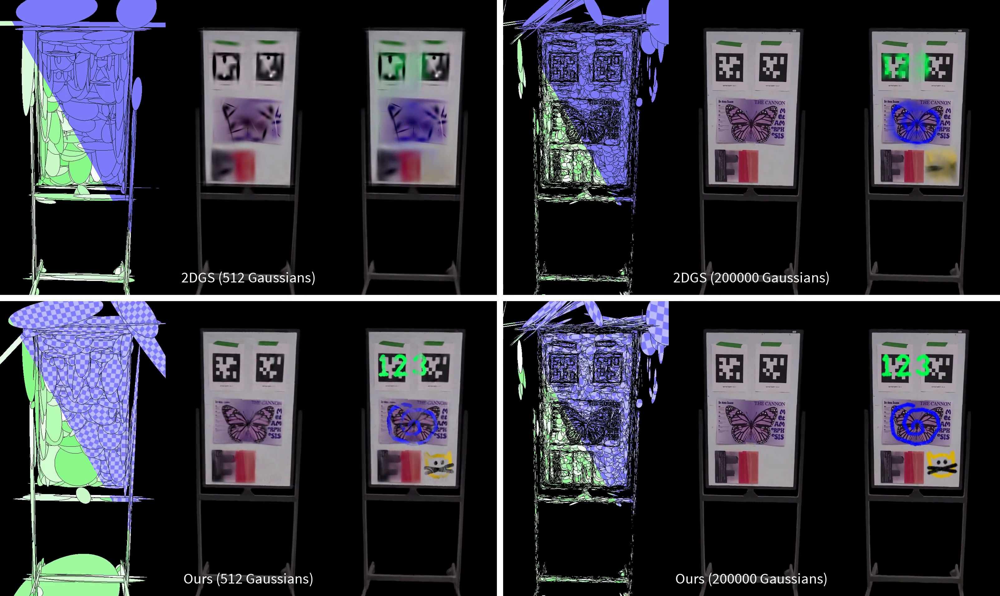
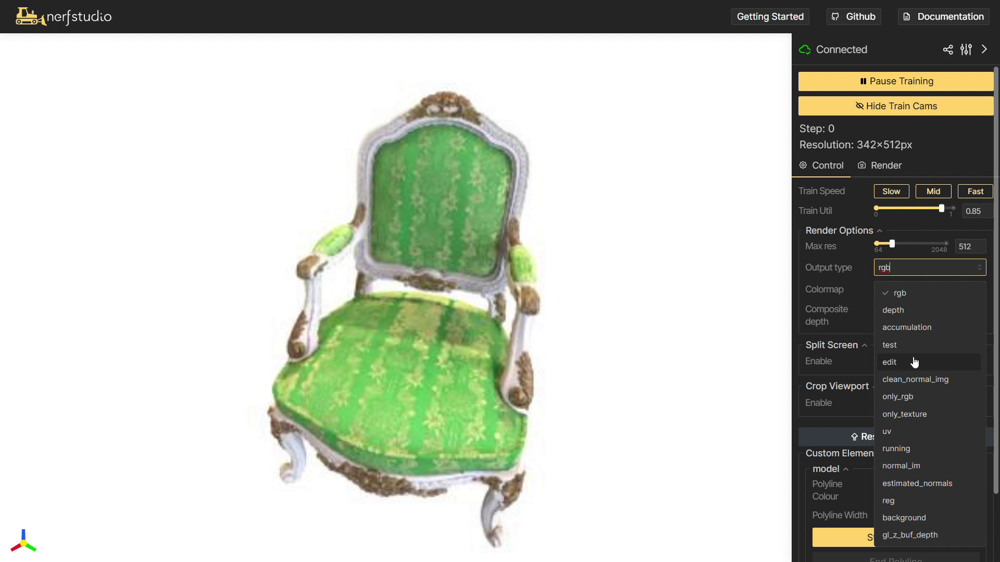
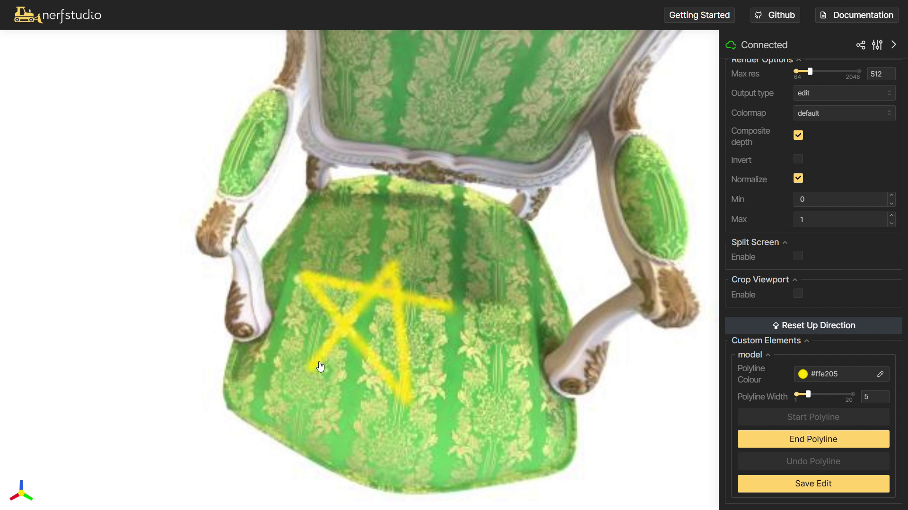

# GStex: Per-Primitive Texturing of 2D Gaussian Splatting for Decoupled Appearance and Geometry Modeling

[Project Page](https://lessvrong.com/cs/gstex) | [Paper](https://arxiv.org/pdf/2409.12954) | [CUDA Rasterizer](https://github.com/victor-rong/GStex_cuda) | [Point Cloud Data (0.8GB)](https://www.dropbox.com/scl/fi/fklfyrd05xx8cnpqi54u4/pcd_data.zip?rlkey=hyo9v69hv7q4y5hw0jvrvcwuc&st=7vfcrejv&dl=0) | [Full Data (6.0GB)](https://www.dropbox.com/scl/fi/9xukw24sn4guyd6s8ddoi/full_data.zip?rlkey=6xk6tu9eluz25swauq0aoprun&st=7h8wbk8e&dl=0) <br>



This is the official repository for "GStex: Per-Primitive Texturing of 2D Gaussian Splatting for Decoupled Appearance and Geometry Modeling". Gaussian splats have no appearance variation across the Gaussians. Our method overcomes this by attaching 2D textures to each Gaussian to model spatially-varying albedo. These can be rendered and trained efficiently in a similar manner to Gaussian splatting.

## Errata

A bug was found that affected our metrics evaluation for 2DGS and GStex. The corrected PSNRs for novel view synthesis are below, and the preprint has been updated with all the corrected numbers.

|    | Blender | DTU |
|----|----|----|
| 3DGS | 33.34 | 32.87 |
| 2DGS | ~~32.61~~ 33.15 | ~~32.28~~ 32.22 |
| Texture-GS | 28.97 | 30.53 |
| Ours | ~~32.91~~ 33.25 | ~~32.31~~ 32.87 |

## Installation

This repository has a CUDA submodule which is also necessary, so be sure to clone this repo recursively.

```bash
git clone https://github.com/victor-rong/GStex.git --recursive
```

After that, set up a conda environment.

```
conda create --name GStex -y python=3.8
conda activate GStex
cd GStex
pip install --upgrade pip setuptools
pip install -e .
```

A NVIDIA GPU supporting CUDA is necessary for the rasterization. CUDA toolkit can be installed using conda. Below, we give an example script for CUDA 12.1, which we tested with. You may need to use a different version depending on your hardware.

```
conda install -c "nvidia/label/cuda-12.1.0" cuda-toolkit
```

Lastly, the CUDA rasterizer can be installed.

```
cd submodules/GStex_cuda
pip install -e .
```

## Training

First, be sure to download our Blender and DTU data from the link above or by using the command below. The full dataset contains all the Blender images and COLMAP-preprocessed DTU images, as well as the point cloud and 2DGS initializations we use. The point cloud dataset only contains the latter. If you are interested in using the whiteboard scene data, please contact us.

```
# full dataset
wget -O data.zip "https://www.dropbox.com/scl/fi/9xukw24sn4guyd6s8ddoi/full_data.zip?rlkey=6xk6tu9eluz25swauq0aoprun&st=7h8wbk8e&dl=1"
unzip data.zip

# just the point clouds
wget -O pcd_data.zip "https://www.dropbox.com/scl/fi/fklfyrd05xx8cnpqi54u4/pcd_data.zip?rlkey=hyo9v69hv7q4y5hw0jvrvcwuc&st=7vfcrejv&dl=1"
unzip pcd_data.zip
```

Then Table 1 of our paper can be reproduced using the scripts provided in `./scripts/`.

```
python scripts/blender_nvs.py --data_dir ./data/blender --point_cloud_dir ./data/blender --start 0 --end 8
python scripts/dtu_nvs.py --data_dir ./data/dtu --data_dir ./data/dtu --start 0 --end 15
```

You can also use your own custom data. As culling and densification is disabled in this pipeline, random initialization (e.g. points sampled from a cube for the Blender scenes) will have limited results. An initialization from COLMAP works, and we also support initializing from [2DGS](https://github.com/hbb1/2d-gaussian-splatting). For example, if your 2DGS output folder is `~/2d-gaussian-splatting/output/123`, then your script would be

```
ns-train gstex \
  --pipeline.model.init-ply "~/2d-gaussian-splatting/output/123/point_cloud/iteration_30000" \
  --pipeline.model.fix-init True \ # for COLMAP data
  --data ./path/to/data \

```

## Editing in the Viewer

Nerfstudio provides a customizable viewer which can be accessed through the browser. We added a texture painting interface to the viewer so that you can visualize texture editing directly on your own GStex models. Here's how:

1. Instantiate a GStex model from an exported 2DGS model. You can select the number of texels using the `pixel-num` config option, with `0` corresponding to 2DGS. We set `1e7` as the default.

```
# example for Blender scenes
ns-train gstex-blender-init \
  --pipeline.model.init-ply ./data/blender/chair/init_nvs/point_cloud.ply \
  blender-data --data ./data/blender/chair

# example for COLMAP scenes
ns-train gstex-colmap-init \
  --pipeline.model.init-ply ./data/dtu/scan24/init_nvs/point_cloud.ply \
  --data ./data/dtu/scan24
```

2. View it on the browser (`localhost:7007` by default) and select the `edit` view. We also recommend a lower resolution such as 512 while painting so that it's more responsive.



3. Use our interface under `Custom Elements` to draw polylines from various views. Due to the limited interactions which [viser](https://github.com/nerfstudio-project/viser) supports, polylines need to be drawn click by click and may take up to a second to appear. Note that the view cannot be changed while you're drawing a polyline.



## Acknowledgements

This codebase is directly built on the [Nerfstudio](https://docs.nerf.studio/) codebase by a great team of [developers](https://github.com/nerfstudio-project/nerfstudio?tab=readme-ov-file#contributors). Much of the method was based on [2DGS](https://surfsplatting.github.io/) by Binbin Huang et al.

## Citation

If you find this repository useful in your projects or papers, please consider citing our paper:
```
@article{rong2024gstex,
  title={GStex: Per-Primitive Texturing of 2D Gaussian Splatting for Decoupled Appearance and Geometry Modeling},
  author={Rong, Victor and Chen, Jingxiang and Bahmani, Sherwin and Kutulakos, Kiriakos N and Lindell, David B},
  journal={arXiv preprint arXiv:2409.12954},
  year={2024}
}
```
